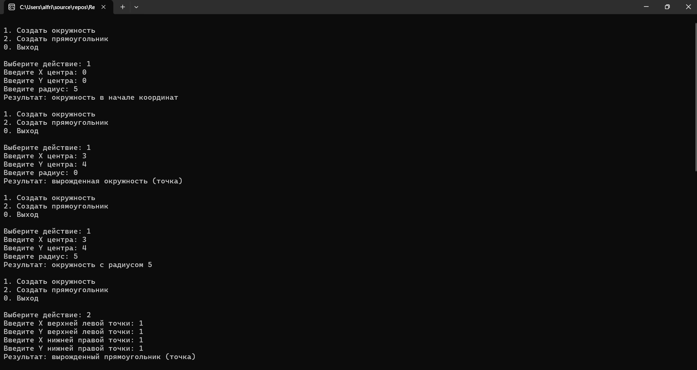
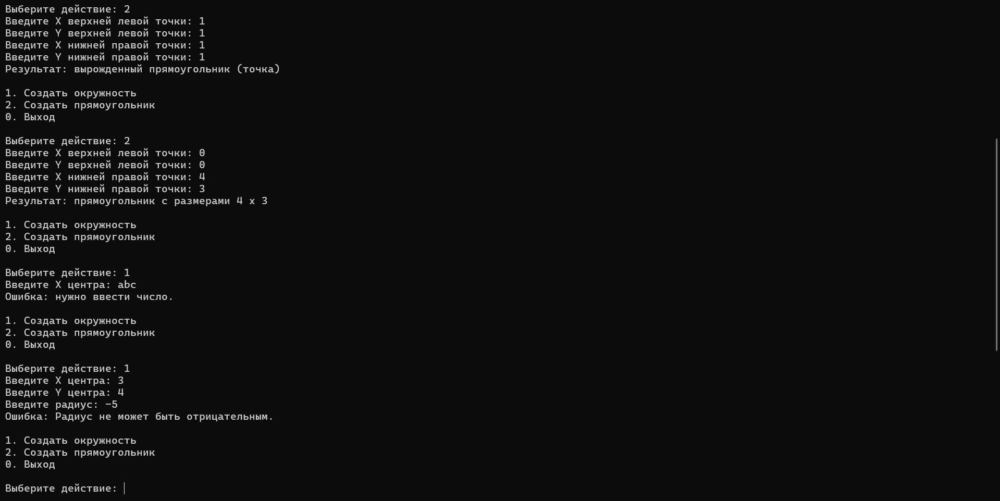

# RecordsAndPattern

## Задание «Контрольная точка №16 — записи и паттерн-матчинг»

# Вариант 1. Геометрические фигуры через записи
1. public record Point(double X, double Y);
2. public record Circle(Point Center, double Radius);
3. public record Rectangle(Point TopLeft, Point BottomRight);
4. Метод string Classify(object shape) через switch-выражение:
Circle { Center: { X: 0, Y: 0 } } (вложенный паттерн) → "окружность в начале координат".
Circle { Radius: 0 } → "вырожденная окружность (точка)".
Circle c → строка с радиусом.
Rectangle r when r.TopLeft == r.BottomRight → "вырожденный прямоугольник (точка)".
Rectangle r → строка с размерами.
_ → "неизвестная фигура".

## Результаты и проверочные ключи
### Проверочные ключи

| Вход | Ожидаемый результат |
|---|---|
| `new Circle(new Point(0, 0), 5)` | `"окружность в начале координат"` |
| `new Circle(new Point(3, 4), 0)` | `"вырожденная окружность (точка)"` |
| `new Circle(new Point(3, 4), 5)` | строка с радиусом `5` |
| `new Rectangle(new Point(1, 1), new Point(1, 1))` | `"вырожденный прямоугольник (точка)"` |
| `new Rectangle(new Point(0, 0), new Point(4, 3))` | строка с размерами |

# Результыты

